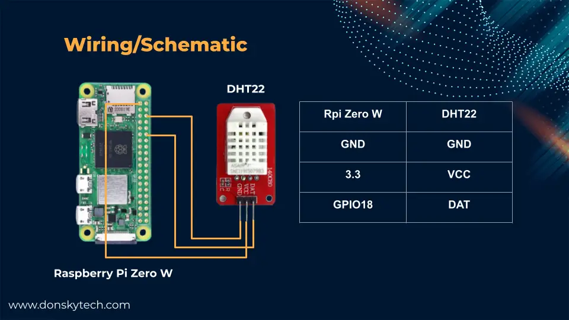

# Steps to set up a raspberry pi controller for the sensors

1. Update the system
    - `sudo apt-get update`
    - `sudo apt full-upgrade`

## Connect DHT22 sensor

1. Refer to the following schematics:

2. Install dependencies:
    - `sudo apt-get install python3-pip git`
    - `sudo pip3 install --upgrade setuptools`
3. Install adafruit-circuitpython-dht library (we avoid using the deprecated Adafruit_DHT one):
    - `git clone https://github.com/donskytech/raspberrypi-projects`
    - `cd raspberrypi-projects/dht22`
4. Install circuitpython dependecies:
    - `sudo pip3 install --upgrade adafruit-python-shell`
    - `wget https://raw.githubusercontent.com/adafruit/Raspberry-Pi-Installer-Scripts/master/raspi-blinka.py`
    - `sudo python3 raspi-blinka.py`
    - select yes when prompted for reboot
5. Install the library:
    - `pip3 install adafruit-circuitpython-dht`

### Example script to read the sensor

Credits to <https://www.donskytech.com/raspberry-pi-how-to-interface-with-a-dht22-sensor/>

```python

# SPDX-FileCopyrightText: 2021 ladyada for Adafruit Industries
# SPDX-License-Identifier: MIT

import time
import board
import adafruit_dht

# Initialize the dht device, with whichever data pin it's connected to:
dhtDevice = adafruit_dht.DHT22(board.D4)

# you can pass DHT22 use_pulseio=False if you wouldn't like to use pulseio.
# This may be necessary on a Linux single board computer like the Raspberry Pi,
# but it will not work in CircuitPython.
# dhtDevice = adafruit_dht.DHT22(board.D24, use_pulseio=False)

while True:
    try:
        # Print the values to the serial port
        temperature_c = dhtDevice.temperature
        humidity = dhtDevice.humidity
        print(
            "Temp: {:.1f} C    Humidity: {}% ".format(
                temperature_c, humidity
            )
        )

    except RuntimeError as error:
        # Errors happen fairly often, DHT's are hard to read, just keep going
        print(error.args[0])
        time.sleep(2.0)
        continue
    except Exception as error:
        dhtDevice.exit()
        raise error

    time.sleep(2.0)
```

## Use a webcam as approximation of a light sensor

1. Install dependencies:
    - `pip install opencv-python` (one could use picamera2 instead but it has limited support for USB cameras, picamera is not supported on 64bit architectures)
    - `sudo apt install libg11`

### Example script to print light level

```python

import cv2

from time import sleep

cap = cv2.VideoCapture(0)

sleep(2) #lets webcam adjust its exposure

# Turn off automatic exposure compensation, this means that
# the measurements are only significant when compared to the
# first one, to get proper lux reading one should use a
# proper light sensor
cap.set(cv2.CAP_PROP_AUTO_EXPOSURE, 0)

while True:
    ret, frame = cap.read()
    grey = cv2.cvtColor(frame, cv2.COLOR_BGR2GRAY)
    avg_light_level = cv2.mean(grey)[0]
    print(avg_light_level)

    if cv2.waitKey(1) & 0xFF == ord('q'):
        break

    sleep(1)

cap.release()
cv2.destroyAllWindows()

```

## Connect sensors to MCP3008 ADC

1. Refer to the following schematics: 
2. Install dependencies:
    - `sudo apt-get install python3-spidev`

The adc can accept 8 inputs in the 8 different channels, channel numbering starts from 0, the pin connected to the channel should be the data pin of the sensor, the other pins should be connected to a 3.3V/5v pin and to the ground pin.

### Classes needed to read the ADC and example script

``` python
#file: MCP3008.py

from spidev import SpiDev

class MCP3008:
    def __init__(self, bus = 0, device = 0):
        self.bus, self.device = bus, device
        self.spi = SpiDev()
        self.open()
        self.spi.max_speed_hz = 1000000 # 1MHz

    def open(self):
        self.spi.open(self.bus, self.device)
        self.spi.max_speed_hz = 1000000 # 1MHz
    
    def read(self, channel = 0):
        adc = self.spi.xfer2([1, (8 + channel) << 4, 0])
        data = ((adc[1] & 3) << 8) + adc[2]
        return data
            
    def close(self):
        self.spi.close()
```

``` python
from MCP3008 import MCP3008

adc = MCP3008()
value = adc.read(channel = 0) # You can of course adapt the channel to be read out
print("Applied voltage: %.2f" % (value / 1023.0 * 3.3))
```

## Connect raspberry pi NoIR camera

1. Connect the camera to the raspberry pi
2. It is possible that we need to modify the `/boot/config.txt` file to enable the camera:
    - `sudo nano /boot/config.txt`
    - uncomment the line `start_x=1`
    - uncomment the line `gpu_mem=128`
    - save and exit
    - reboot
3. Install dependencies:
    - `sudo apt-get update`
    - `sudo apt-get install -y python3-pyqt5 python3-opengl`
    - `sudo apt-get install -y python3-picamera2 --no-install-recommends`
    - `sudo pip3 install -U numpy`
    - `sudo pip3 install opencv-python`
    - `sudo apt install -y libatlas-base-dev`
